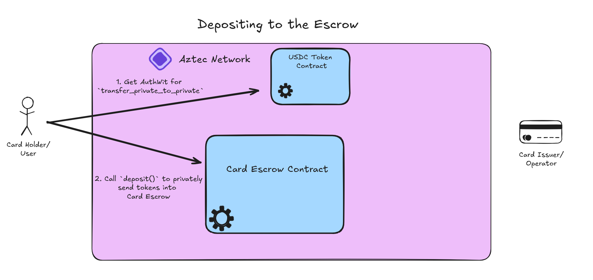

# Depositing Onchain Funds into the Card Escrow

## Depositing


Privately depositing funds into the escrow is a relatively trivial process. Keep in mind that this escrow uses [Defi Wonderland's Token Standard](https://github.com/defi-wonderland/aztec-standards/tree/dev/src/token_contract) so transfer operations will use `transfer_private_to_private()`.

In order to constrain deposits to go to escrow contract, `CardEscrow::deposit()` will handle calling `Token::transfer_private_to_private()`. This means that we first need to [generate an authwit](../packages/contracts/ts/src/contract.ts#L116-L125) that authorizes the contract to make this call:
```js
const nonce = Fr.random();
const authwit = await caller.createAuthWit({
    caller: escrow.address,
    action: token.methods.transfer_private_to_private(
        caller.getAddress(),
        escrow.address,
        amount,
        nonce,
    ),
});
```

Then, as the user who deployed the contract/ has the chard card, we can [call the function](../packages/contracts/ts/src/contract.ts#L127-L132) `CardEscrow::deposit(amount,nonce)`:
```js
await escrow
    .methods
    .deposit(amount, nonce)
    .with({ authWitnesses: [authwit], })
    .send()
    .wait();
```

## Operator Funding
Ideally, a web app would include an API call notifying the card operator of this deposit. However, given Aztec is a decentralized blockchain, the card operator should consistently have a PXE account connected with the contract account (as shown in the [escrow setup](./escrow_setup.md) section) and scan for new token notes owned by the contract. This can simply be done with:
```js
await token.methods.sync_private_state().simulate();
const balance = await token
    .methods
    .balance_of_private(escrow.address)
    .simulate();
```

This balance will of course change with new deposits, [spends](./spends.md), or [withdrawals](./withdrawals.md). While detailed more in these sections, the operator should have their own internal model for tracking current available balance but should syncronize with chain state aggressively and defensively to be safe.

