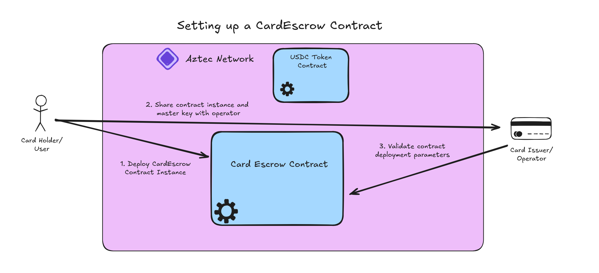

# Setting up the Card Escrow


## Generating Contract Secret Key and Deploying
The card escrow contract uses a special private escrow pattern to allow fully private transfers that only escrow parties know about. To do this, the card user (escrow deployer) must [generate private keys for the contract and deploy with a specific function](../packages/contracts/ts/src/contract.ts#L45-L61):
```js
// generate keys for contract
const contractSecretKey = Fr.random();
const contractPublicKeys = (await deriveKeys(contractSecretKey)).publicKeys;

// set up contract deployment tx
const contractDeployment = await Contract.deployWithPublicKeys(
    contractPublicKeys,
    deployer,
    CardEscrowContractArtifact,
    [...args],
);
```
When creating a new escrow contract, a static "PrivateImmutable" [`ConfigNote`](../packages/contracts/src/types/config_note.nr) is created. This config note will govern much of the functionality of the CardEscrow, including:
 * defining authorized roles for certain actions with `user_address` and `operator_address`
 * defining the token that will be used to reimburse charge card spends with `token_address`
 * defining the `operator_pubkey` values that allow an operator to consent to `withdraw()` and `change_spend_limit()` actions

Additionally, the user will set up a "PrivateMutable" [`SpendLimitNote`](../packages/contracts/src/types/spend_limit_note.nr) that governs the maximum the operator can withdraw from the escrow in a given day. This is detailed more in the [spending](./spends.md) and [spend limit changing](./spend_limit_change.md) docs.

All notes in the escrow will be encrypted to the contract's key, meaning anyone who [adds this account to their PXE](../packages/contracts/ts/src/contract.ts#L64-L67) can decrypt the notes and execute contract functions that govern how they are used!
```js
const instance = await contractDeployment.getInstance()
const partialAddress = await computePartialAddress(instance);
await pxe.registerAccount(contractSecretKey, partialAddress);
```

## Delivering to the Card Operator
The contract will be publicly deployed and can be used by the user! However, we still need to get it to the card operator for them to use. The card operator needs two things to get started (same variables as shown above):
 * The `contractSecretKey`
 * The `contractInstance`
You can imagine some sort of web application that encrypts and transmits this data directly to the card operator. Once the operator has this, [they can add contract instance and account to their pxe](../packages/contracts/ts/src/contract.ts#L177-L194):
```js
await pxe.registerContract({
    instance: contractInstance,
    artifact: CardEscrowContractArtifact
});
await pxe.registerAccount(escrowSecretKey, escrowPartialAddress);
await pxe.registerSender(escrowAddress);
```
## Operator Validation of the Escrow
Now that the operator can read and interact with the escrow, they should actually validate the escrow is suitable before allowing the user to spend with it.

Firstly, the operator needs to [check the validity of the contract](../packages/contracts/ts/src/contract.ts#L204-L210) by confirming the contract address can be computed from the expected contract artifact:
```js
// NOTE: this should be modified to inject the card artifact into the instance!
export const validateContractAddress = async (
  claimedAddress: AztecAddress,
  instance: ContractInstanceWithAddress,
): Promise<boolean> => {
  const computed = await computeContractAddressFromInstance(instance);
  return computed.equals(claimedAddress);  
}
```
If the computed address matches the expected address, the operator knows that the logic of this contract deployment will behave as expected!

Next, the operator should check the configuration of the escrow:
```js
const config = await escrow.methods.get_config().simulate();
```
The operator will want to confirm
 * `token_address` is the payment token they expect,
 * `operator_address` is the address they want to authenticate `spend()` calls from
 * `operator_pubkey_x` and `operator_pubkey_y` are the signing keys they want to consent to `withdraw()` and `change_spend_limit()` calls from

Additionally, the operator will want to get the current spend limit to finalize setup and know how much they can allow the user to spend from their charge card with:
```js
const spend_limit = await escrow.methods.get_spend_limit().simulate();
```
Spend limit returns as a `u128` and should be normalized to the number of decimals used in the token contract at `token_address`
