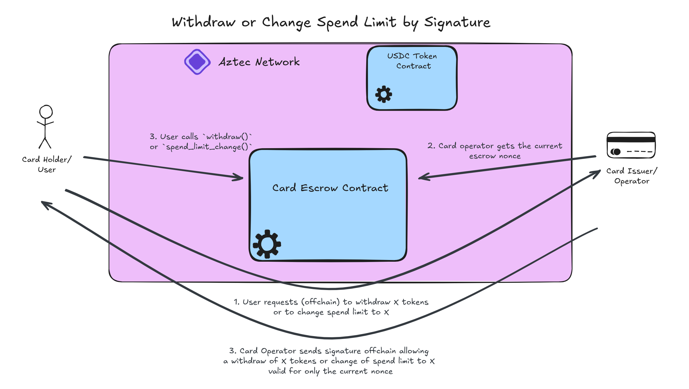

# Signed Operations


As quoted from the [timelock docs](./timelocks.md), when dealing with two disjoint payment systems (card payments and onchain payments), there is the potential for abuse by the user. If the user were able to unilaterally call `withdraw()` they could spend with their card while simultaneously withdrawing all the funds from the escrow, preventing the card operator from reimbursing themselves. Similarly, if they could call `change_spend_limit()` unilaterally, they could revise to a lower amount (or even 0!) to prevent the operator from reimbursing themselves. 

As mentioned in the [withdrawal](./withdrawals.md) and [spend limit change](./spend_limit_change.md) docs, we provide a method for doing these changes in an adversarial environment. However, we also provide an API pattern doing these operations cooperatively.

Simply put, a user will make an offchain request to the card operator to perform one of these actions, and the card operator will provide a signature authorizing this action to happen. Instead of having a timelock which takes time and leaks privacy, the user can validate the signature and immediately, privately perform the action.

## Nonces
Each card escrow has a PrivateMutable ["EscrowNonceNote"](../packages/contracts/src/types/escrow_nonce_note.nr) which simply holds an incrementing nonce. We use this nonce to allow the operator to consent to an action when the escrow is at a specific state. To prevent the user from requesting a signature and not immediately using it for its intended purpose, all functions except `deposit()` will call the [`_bump_nonce()`](../packages/contracts/src/main.nr#L750-L762) hook at the end, invalidating any issued signature if it is not immediately used.

The nonce can be requested via the [`get_nonce()`](../packages/contracts/src/main.nr#L770-L772) utility:
```js
const nonce = await escrow
    .methods
    .get_nonce()
    .simulate()
```

## Signing
Recall from the [setup docs](./escrow_setup.md) that our constructor initialized a `ConfigNote` containing `operator_pubkey_x` and `operator_pubkey_y` - this is a schnorr pubkey that the operator should supply any user when they create the escrow (they should of course refuse service with an escrow where the signing key is incorrectly set). When calling `withdraw()` or `change_spend_limit()`, the private functions will retrieve this pubkey to verify the authenticity of messages.

When a user wants to withdraw or change the spend limit, they will likely make an API request to the operator asking for "operation X of amount Y". The operator will then [construct the preimage, hash it with Poseidon2, and Schnorr sign it](../packages/contracts/ts/src/utils.ts#L28-L46) like so:
```js
export const buildSignedEscrowMessage = async (
    signingKey: Fq,
    contractAddress: AztecAddress,
    value: bigint,
    nonce: Fr,
    action: "withdraw" | "spendLimit"
): Promise<Buffer> =>  {
    const schnorr = new Schnorr();
    
    const message = await poseidon2Hash([
        contractAddress.toBigInt(),
        value,
        nonce,
        action === "spendLimit" ? 1n : 2n,
    ]).then(message => message.toBuffer());

    const signature = await schnorr.constructSignature(message, signingKey);
    return signature.toBuffer();
}
```
The operator should proactively adjust the available amount from the user's card before returning the signature, and may choose to deny the operation if there are indications that the user is actively trying to deceive the operator.

## Using Signatures
Once the signature is returned to the user, so long as they haven't called any function other than `deposit()` and that the operator has not called `spend()`, they can now call `withdraw()` or `change_spend_limit()`.

The private function call will take the signature and amount as arguments, retrieve the signing key from the `ConfigNote`, and the escrow nonce from the `EscrowNonceNote`. Additionally, based on whether it is a withdraw or spend limit change, there is a "SIG_SEPARATOR" value provided to prevent the user from requesting a large spend limit change and instead using it to withdraw.

```rust
// authorize this call
let config = storage.config.get_note();

// get the escrow nonce
let mut escrow_nonce_note = storage.escrow_nonce.get_note().note;

// create the preimage
let preimage = [
    context.this_address().to_field(),
    amount as Field,
    escrow_nonce_note.nonce,
    WITHDRAW_SIG_SEPARATOR
];
// hash into message
let payload: [u8; 32] = Poseidon2::hash(preimage, 4).to_le_bytes();
// verify signature
schnorr::verify_signature(
    config.operator_schnorr_pubkey(),
    signature,
    payload
);
```

Additionally, using a signature will check that there isn't already a timelocked operation pending. This may be redundant or provide negligible security and may be removed upon gaming out the scenarios, but is included to prioritize security.

Assuming the nonce is correct, the contract knows that the user has the consent of the operator to perform this operation! The benefits of this pattern are:
 * We can do this operation in one transaction instead of two (prepare and finalize)
 * We don't have to wait 30 blocks (or whatever is chosen) between preparation and finalization
 * The entire operation is public - we don't need to check blocks have elapsed in the public context