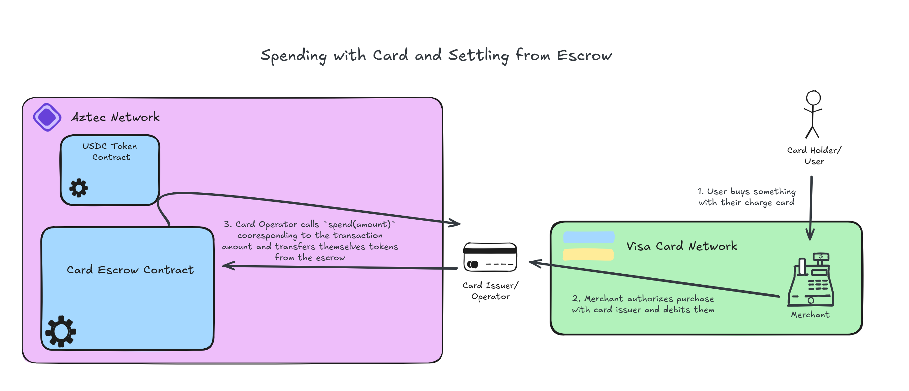

# Spending with the Aztec Card


This section is not concerned with integration with any charge card network and only concerns the onchain interactions needed to facilitate spending with the charge card!

Spending in the Aztec Card escrow is a __CUSTODIAL__ action - the operator can pull funds from the escrow unilaterally so long as it does not exceed a spend limit detailed below.

NOTE: Spending is the only required operation that leaks pricacy. Calling `check_epoch()` indicates ONLY that some sort of spend occurred, but nonetheless does leak the fact that a spend occured. In the future, some sort of DelayedPublicMutable epoch value in a separate contract shared by many escrows could fix this. 

## Epochs
As mentioned in the [escrow setup docs](./escrow_setup.md), a user initially sets a spend limit which constricts how much an operator can withdraw at any point. This can be changed, as detailed in the [spend limit change](./spend_limit_change.md) docs. 

Spend limits are applied per day - for instance, if a spend limit of $10,000 is set, then the card operator is authorized to withdraw up to 10,000 USDC tokens (or whatever currency is being used) every day. These days are referred to in the code and from here on out as "Epochs".

An epoch is calculated by getting the current block timestamp and dividing it by `CardEscrow::EPOCH_LENGTH` which is equal to 86400 (the seconds in a day). In js, [this can be done simply with the PXE](../packages/contracts/ts/src/utils.ts#L48-53):
```js
export const computeEpoch = async (pxe: PXE): Promise<bigint> => {
    const block = await pxe.getBlock(await pxe.getBlockNumber());
    if (!block) throw new Error("No block found");
    const timestamp = block.header.globalVariables.timestamp;
    return timestamp / 86400n;
}
```

In Aztec, the timestamp is not known in the private context. This means when calling `spend(amount,epoch)` we supply an asserted `epoch` value. The private `spend()` function will enqueue a [public call to the internal `check_epoch(asserted_epoch)` function](../packages/contracts/src/main.nr#L669-L675) that will ensure that the asserted epoch is correct:
```rust
#[public]
#[internal]
fn check_epoch(asserted_epoch: Field) {
    let timestamp = context.timestamp();
    let current_epoch = (timestamp / EPOCH_LENGTH) as Field;
    assert(current_epoch == asserted_epoch, "Epoch mismatch!");
}
```

## Spend Limits
With an understanding of epochs, we can look at how they govern spending limits.

In order to privately constrain that a spend limit is not exceeded, we have a mapping of epoch values to PrivateMutable [`SpentAmountEpochNotes`](../packages/contracts/src/types/spent_amount_epoch_note.nr) and the aforementioned PrivateMutable [`SpendLimitNote`](../packages/contracts/src/types/spend_limit_note.nr).

When doing a `spend()` call, we will need to retrieve the current spend limit and the current spent amount for the asserted epoch, then check the requested spend amount + already spent amount do not exceed the spending limit:
```rust
let mut spent_amount_epoch_note = storage.spend_epoch.at(epoch).get_note().note;
let spend_limit = _get_spend_limit_and_reemit(&mut context, storage.spend_limit);
spend_amount_epoch_note.spent_amount += amount;
assert(spend_limit >= spend_amount_epoch_note.spent_amount);
```
Note that [`_get_spend_limit_and_reemit()`](../packages/contracts/src/main.nr#L699-L710) is a utility that handles getting a PrivateMutable note and re-emitting it when we only want to read the value inside of the note. Since every read of a mutable note nullifies it and re-adds it, we need to rebroadcast the note since multiple PXE's are receiving notes for the contract account and the user's PXE will not know of the new note!

For every first spend of the current epoch, we can't just call `storage.spend_epoch.at(epoch).get_note()` however! We can actually just [check if it is initialized, and if it isn't create a note](../packages/contracts/src/main.nr#L167-L171). In this case, we are essentially just checking if the requested spend amount exceeds the spent amount.

Once we've confirmed that spending `amount` does not overflow the spend limit for the epoch, we save the new total amount spent for the epoch and can proceed with spending.

## Spending Summary
Private spending (`spend(amount,epoch)`)consists of the following components :
 * Checking that the caller of the function is the `operator_address` in the config
 * Checking that spending `amount` for the asserted `epoch` does not exceed the spend limit for the epoch, including already spent amounts for the epoch
 * Updating the spent amount
 * Transferring `amount` tokens from the card escrow to the operator's account
 * Checking the privately asserted `epoch` against an epoch computed in and enqueued public function
 * Bumps the `EscrowNonce` (see ["signed operations docs"](./signed_operations.md)