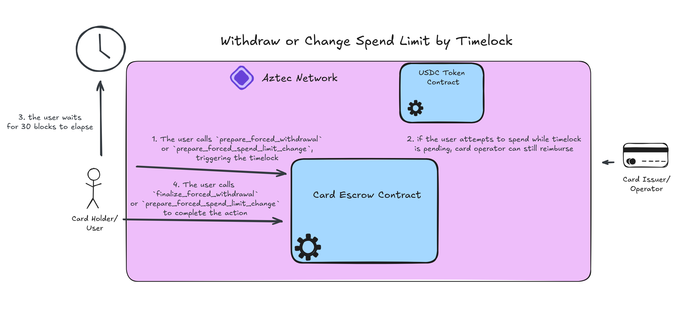

# Timelocked Operations

When dealing with two disjoint payment systems (card payments and onchain payments), there is the potential for abuse by the user. If the user were able to unilaterally call `withdraw()` they could spend with their card while simultaneously withdrawing all the funds from the escrow, preventing the card operator from reimbursing themselves. Similarly, if they could call `change_spend_limit()` unilaterally, they could revise to a lower amount (or even 0!) to prevent the operator from reimbursing themselves. 

As mentioned in the [withdrawal](./withdrawals.md) and [spend limit change](./spend_limit_change.md) docs, we provide a method for doing these changes in an adversarial environment. We also provide an API pattern doing these operations cooperatively which is detailed in the [signed operation docs](./signed_operations.md). If we choose to provide the cooperative API, it is critical to also provide a fallback for the user if the card operator refuses service. While the spending is a custodial operation and a high spend limit could theoretically drain the escrow before the user can do anything about it, this provides some defensive measures for the card user to permissionlessly exfiltrate their funds from the card escrow without allowing the user to abuse this to double spend.

## Preparing a Timelock
In order to set a timelock, there is a public and private component. 

Privately, we use a PrivateMutable [`TimelockedNote`](../packages/contracts/src/types/timelocked_note.nr) which contains a `proposed_spend_limit` and a `proposed_withdraw_amount`. Primarily, we use these to store the values during the timelock without acting on them. A critical secondary function is that the operator monitoring their PXE for these notes can see the user's proposed actions actions and can call `spend()` if it appears that the user is trying to double spend. The operator can additionally monitor the public Timelock struct and then go to retrieve this private note.

Publicly, we have a PublicMutable [`Timelock`](../packages/contracts/src/types/timelock.nr) wihch contains a `spend_limit_timelock` and a `withdraw_timelock`. These values are how we keep track of whether a timelock exists and when that timelock elapses.

When calling `prepare_forced_withdrawal()` or `prepare_forced_spend_limit_change`, we have relatively simple operations:
1. retrieve the `TimelockedNote`
2. update the `proposed_withdraw_amount` (if calling the withdraw preparation) or `proposed_spend_limit_change` (if calling the spend limit change preparation)
3. saving the changed note and emitting it
4. publicly enqueueing a call to [`_set_timelock()`](../packages/contracts/src/main.nr#L598-L612) to set the timelock

To ensure timelocks are not overwritten, in `set_timelock()` publicly we check that the timelock we are trying to set is 0. If this is confirmed, we set the value to the current block.

## Spending During a Timelock
As mentioned, the timelocked functions are included to handle an adversarial environment - both where the operator doesn't provide signatures and where the user tries to double spend. This section addresses the latter case.

When the operator detects a change to the timelock for an escrow, they should immediately internally revise the available amount for the user to spend to their card if it is a withdrawal or a spend limit change lower. If it is a spend limit change higher, they should wait until the spend limit change has been finalized before giving the user a higher spend limit since they can just not finalize the timelock or even call `cancel_timelocks()` to invalidate the change.

However, there are race conditions here where a user might make a spend on their card and additionally prepare a withdrawal or spend limit change that makes it impossible for the card operator to reimburse this spend. Additionally, the card operator may choose to wait until the end of the day and batch multiple spends together in one transaction to save on gas costs. In either case, the operator's hand has been forced and they have `CardEscrow::TIMELOCK_BLOCKS` (30) blocks to react to the impending bad debt.

However, asides from the monitoring infrastructure and forced deviation from a batched debit schedule, the process of debiting is no different. The card operator will simply call `spend()` as is documented in the [spending docs](./spends.md).

## Finalizing a Timelock
After `CardEscrow::TIMELOCK_BLOCKS` (30) blocks, the user can call `finalize_forced_withdrawal()` or `finalize_forced_spend_limit_change`. This process is again relatively straightforward:
1. retrieve the proposed withdrawal amount or spend limit change
2. save the reset the `TimelockedNote` and emit the change
3. transfer the tokens or update the PrivateMutable `SpendLimitNote`
4. enqueue a public call to [`_elapse_timelock()`](../packages/contracts/src/main.nr#L623-L641) to check the timelock has elapsed and reset the `Timelock` public struct

If the timelock has not elapsed, or if the timelock is set to 0, the `_elapse_timelock()` function will revert and prevent the action from occurring. Once it has confirmed that a valid timelock has elapsed, it will set the value back to 0 and allow the action to go through.

## Cancelling a Timelock
While the case where cancelling a timelock is needed is not really apparent, the functionality is included to ensure no edge cases. A user can simply call [`cancel_timelocks(spend_limit,withdraw)`](../packages/contracts/src/main.nr#L537-L567) to unset either or both timelocks by providing a boolean for each argument dictating that either the spend_limit or withdrawl timelocks should be unset.

Cancellation will first wipe whatever value was privately set in the `TimelockedNote`, then enqueue a call to [`_cancel_timelock()`](../packages/contracts/src/main.nr#L650-L661) to publicly unset the `Timelock` struct. This action has no validation asides from an auth check as it can't have malicious side effects for the card operator. However, the card operator should still monitor for these changes as well and revise the internal available spend amounts given to the card if proposed changes are repealed.